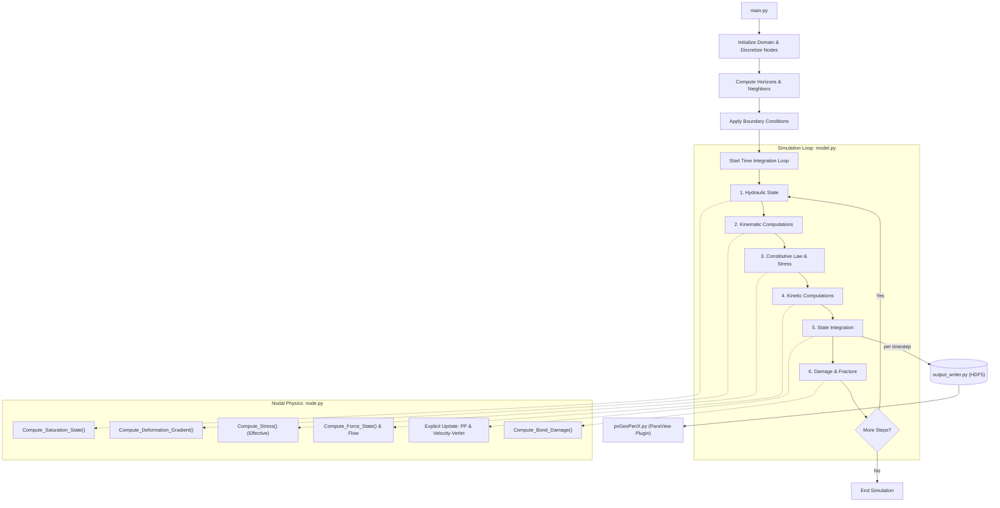

# Geo-Perix-Main
# GeoPeriX: Computational Pipeline and Workflow

GeoPeriX is a high-fidelity, meshless simulation framework designed for modeling localized failure in geomaterials. It bridges advanced nonlocal solid mechanics with multiphase fluid flow to simulate complex geomechanical phenomena.

This document outlines the theoretical foundations, the step-by-step computational pipeline, and the project's broader impact on geospatial peridynamics.

---

## 1. Physical Models Developed

GeoPeriX pioneers the integration of several advanced physical models into a single, cohesive meshfree environment:

*   **Non-Ordinary State-Based Peridynamics (NOSB-PD)**: Overcoming the Poisson's ratio restrictions of classic bond-based peridynamics, our NOSB implementation permits the use of any classical continuum constitutive model (e.g., Linear Elastic, Drucker-Prager plasticity). 
*   **Zero-Energy Mode Stabilization**: NOSB models inherently suffer from numerical instability (zero-energy modes). GeoPeriX implements the rigorous penalty-based stabilization approach (Li et al., 2018) via non-uniform deformation states to ensure mathematically rigorous and physically accurate deformation gradients.
*   **Unsaturated Periporomechanics (Hydro-Mechanical Coupling)**: Based on the formulation by Menon and Song (2021), GeoPeriX natively supports multiphase soils containing both air and water. 
    *   It uses the **van Genuchten Soil-Water Retention Curve (SWRC)** to dictate the relationship between matric suction (negative pore pressure) and the degree of saturation.
    *   It employs **Bishop's Effective Stress Principle** ($\overline{\sigma} = \sigma - \tilde{S}_r p_w \mathbf{I}$) to dynamically alter the shear strength (apparent cohesion) of the soil matrix as moisture content fluctuates.

---

## 2. The Computational Pipeline (Step-by-Step)

The GeoPeriX codebase strictly separates concerns between element-level physics (`node.py`), domain-level orchestration (`model.py`), and visualization (`output_writer.py` & `pvGeoPeriX.py`). 

Here is the algorithmic flow of a standard simulation:

### Phase I: Initialization (`main.py` & Domain Setup)
1.  **Discretization**: The continuous geospatial domain is discretized into a finite set of material points (nodes).
2.  **Neighborhood Construction**: A spatial search algorithm establishes the "Horizon" (interaction radius) for each node, linking it to its neighbors to form the nonlocal peridynamic network.
3.  **Boundary Conditions**: Fictitious boundary layers of nodes are generated outside the physical domain. These act as proxy volumes to rigorously apply Dirichlet (displacement/pressure) and Neumann (traction/flux) constraints.

### Phase II: The Simulation Loop (`model.py`)
The solver utilizes an explicit time-stepping approach (Velocity-Verlet for mechanics, Forward-Euler for fluids). At each time step $\Delta t$, the following sequence occurs across all nodes:

1.  **Hydraulic State Update**:
    *   **Saturation Update**: `Compute_Saturation_State()` evaluates the current degree of saturation and relative permeability based on the nodal pore pressure via the SWRC.
2.  **Kinematic Computations**:
    *   **Deformation Gradient**: `Compute_Deformation_Gradient()` calculates the NOSB shape tensor and deformation gradient $F$ by integrating the relative displacements of neighboring bonds.
    *   **Strain Rate**: `Compute_Deformation_Gradient_Rate()` computes the velocity gradient and volumetric strain rate.
3.  **Constitutive Law & Stress**:
    *   **Polar Decomposition**: Unrotated deformation tensors are extracted to ensure objectivity during large rotations.
    *   **Effective Stress**: `Compute_Stress()` calculates the mechanical stress from the strain state, and then subtracts the fluid pressure scaled by the effective saturation (Bishop's stress).
4.  **Kinetic Computations (Force & Flow)**:
    *   **Hydro-Flow**: `Compute_Pore_Pressure_Gradient()` and `Compute_Fluid_Flow_State()` evaluate the nonlocal Darcy flux and mass flow state integrals to determine the net fluid flow into the node.
    *   **Force State**: `Compute_Force_State()` integrates the Piola-Kirchhoff stress tensors of neighboring nodes, applying the stabilization penalty terms to compute the net internal force density acting on the node.
5.  **State Integration**:
    *   **Pore Pressure**: `Compute_Pore_Pressure_Rate()` determines the time derivative of pore pressure by balancing fluid mass against the volumetric strain rate (solid dilatancy) and fluid storage capacity. Pore pressure is stepped forward.
    *   **Mechanics**: The explicit Velocity-Verlet integrator updates nodal accelerations, velocities, and displacements based on the net internal and external forces.
6.  **Damage & Fracture**:
    *   `Compute_Bond_Damage()` assesses the stretch of individual bonds against a critical threshold. Bonds exceeding the limit irreversibly break, mathematically representing the initiation and propagation of cracks or shear bands.

### Phase III: Output & Visualization
1.  **HDF5 Archiving**: `output_writer.py` buffers the massive arrays of nodal data (Displacement, Stress, Damage, Pore Pressure) and flushes them to highly compressed `.h5` datasets optimized for time-series access.
2.  **ParaView Reconstruction**: The custom Python plugin (`pvGeoPeriX.py`) acts as a bridge. When loaded in ParaView, it intercepts the raw 1D/2D HDF5 arrays, dynamically maps them onto a 3D `vtkUnstructuredGrid`, and injects the temporal metadata, enabling high-fidelity, interactive 3D rendering of the evolving failure surfaces and fluid fronts.

---

## 3. Contribution to Geospatial Peridynamics

Traditional Finite Element Methods (FEM) rely on spatial derivatives of continuous functions, which mathematically break down (yielding singularities) when faced with discontinuities like fractures, faults, or massive shear banding.

GeoPeriX circumvents this via its integral-based peridynamic formulation. By replacing spatial derivatives with integrals over a nonlocal horizon, the equations remain valid even when the material tears itself apart. 

**Key Contributions to the Field:**
*   **Large Deformation Geomaterials**: Enables the stable simulation of catastrophic geospatial events (e.g., landslides, sinkholes, dam failures, and subsidence) where the soil mass undergoes severe distortion and fragmentation.
*   **Multiphase Hazard Assessment**: By accurately coupling pore water pressure generation and dissipation with large-strain mechanics, GeoPeriX provides a mechanistic tool to investigate how environmental triggers (like heavy rainfall infiltration or drought desiccation) cause the sudden loss of apparent cohesion that precipitates catastrophic slope failure. 
*   **Open Visualization Tooling**: The development of the ParaView extension lowers the barrier to entry for analyzing complex nonlocal data structures in geospatial research.

